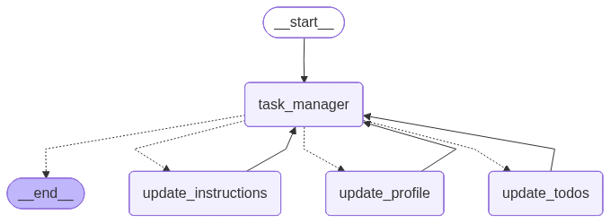

# 🧠 Long Memory Task Manager Agent

A production-ready LangGraph agent designed to manage a user's long-term memory, including **Personal Profiles**, **To-Do Lists**, and **Custom Interaction Instructions**.




## 🌟 Key Features

- **Long-Term Memory Persistence**: Automatically extracts and stores user information, tasks, and preferences across sessions using LangGraph's `Store`.
- **Intelligent Routing**: A central `task_manager` node uses tool-calling to decide which memory type needs updating based on user intent.
- **Trustcall Integration**: Uses the `trustcall` library for robust, schema-driven memory extraction and "PatchDoc" style updates to existing records.
- **Modern Streamlit Frontend**: 
  - Real-time streaming chat.
  - Thread management (History, Rename, Delete).
  - Visual memory panels (Profile, Todos, Instructions).
  -
- **Multi-Modal Support**: Capability to handle image and text attachments for task extraction.

## 🏗️ Project Structure

```text
long_memory_agent/
├── nodes/                  # Graph functional units
│   ├── task_manager.py     # Central reasoning node
│   ├── update_profile.py   # User profile extraction (Trustcall)
│   ├── update_todos.py     # To-Do list extraction (Trustcall)
│   └── update_instructions.py # Instruction self-refinement
├── edges/                  # Routing logic
│   └── routing.py          # Conditional edges based on tool calls
├── agent.py                # Graph definition and compilation
├── schemas.py              # Pydantic models & TypedDicts
├── prompts.py              # System messages & extraction templates
├── utils.py                # Trustcall spies & formatting helpers
├── streamlit_app.py        # Modern Frontend (langgraph-sdk)
└── .env                    # Environment variables (API keys)
```

## 🚀 Getting Started

### 1. Installation

Ensure you have Python 3.10+ installed. Install the required dependencies:

```bash
pip install -r requirements.txt
```

*Note: Dependencies include `langgraph`, `langchain-openai`, `trustcall`, `langgraph-sdk`, and `streamlit`.*

### 2. Configuration

Create a `.env` file in the root directory:

```env
OPENAI_API_KEY=your_api_key_here
OPENAI_MODEL=gpt-4o  # or gpt-4o-mini
```

### 3. Launching the Backend

Use the LangGraph CLI to run the agent in development mode:

```bash
langgraph dev
```
This will start the LangGraph API server at `http://localhost:2024`.

### 4. Launching the Frontend

In a new terminal, run the Streamlit app:

```bash
streamlit run streamlit_app.py
```

## 🔄 How It Works: The Memory Loop

1. **Input**: User sends a message (e.g., "Add 'Buy milk' to my list and remember I'm a chef").
2. **Reasoning**: The `task_manager` node analyzes the input. It detects both a task and profile info.
3. **Routing**: It calls the `UpdateMemory` tool with `update_type="todo"` and `update_type="user"`.
4. **Extraction**: 
   - `update_todos` uses `trustcall` to extract the task into the `ToDo` schema.
   - `update_profile` extracts the job into the `Profile` schema.
5. **Persistence**: The updates are saved to the LangGraph `Store` (cross-thread persistence).
6. **Response**: Control returns to `task_manager` to give a natural language confirmation.

## 🛠️ Customization

- **Schemas**: Modify `schemas.py` to add new fields to the `Profile` or `ToDo` models.
- **Prompts**: Edit `prompts.py` to change the agent's personality or extraction logic.
- **Graph**: Update `agent.py` to add new specialized memory nodes.

---
*Built with ❤️ using LangGraph and LangChain.*
